# Splunk

## Registration

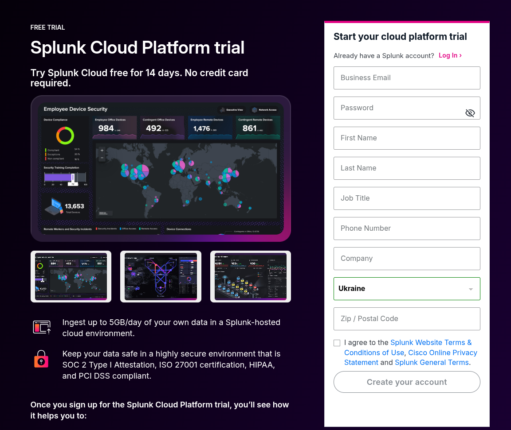

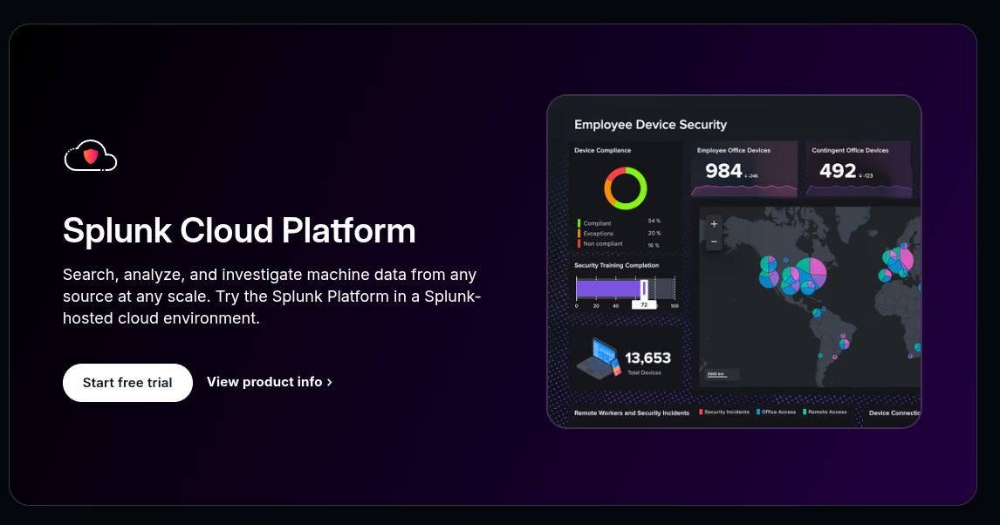

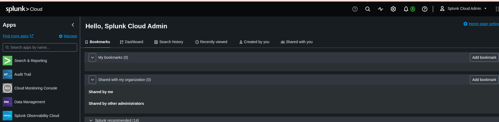

## Upload data into Splunk

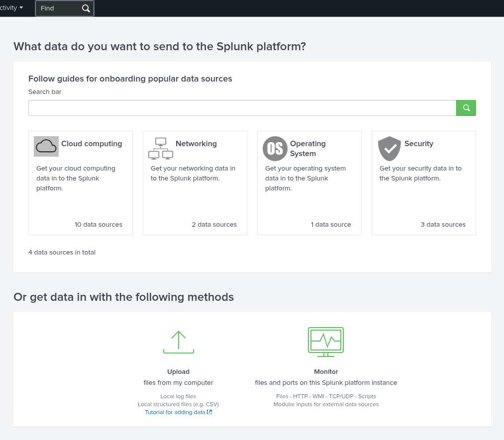

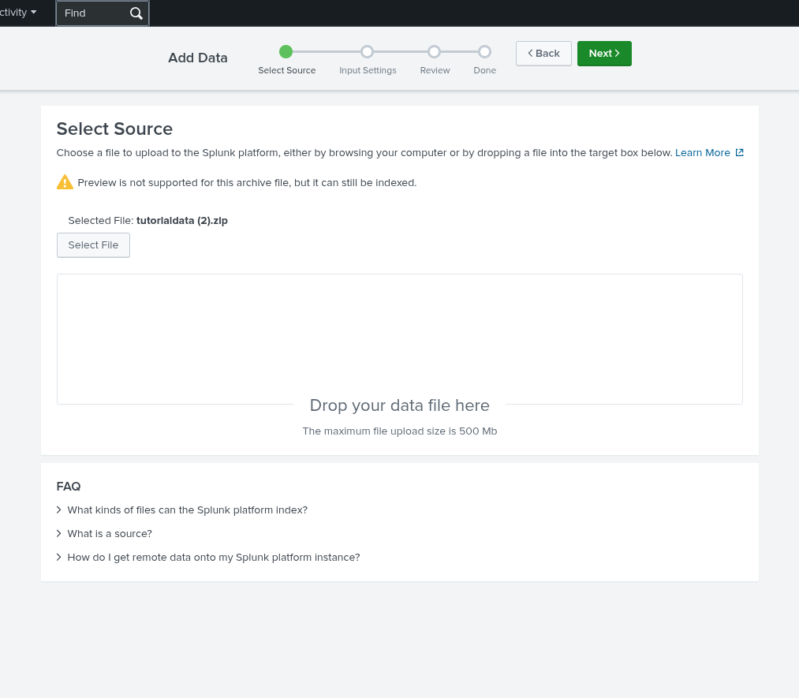

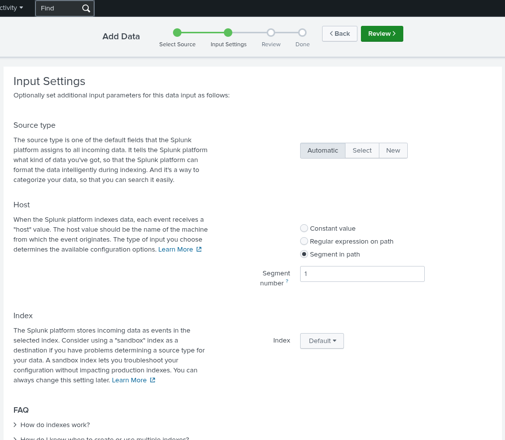

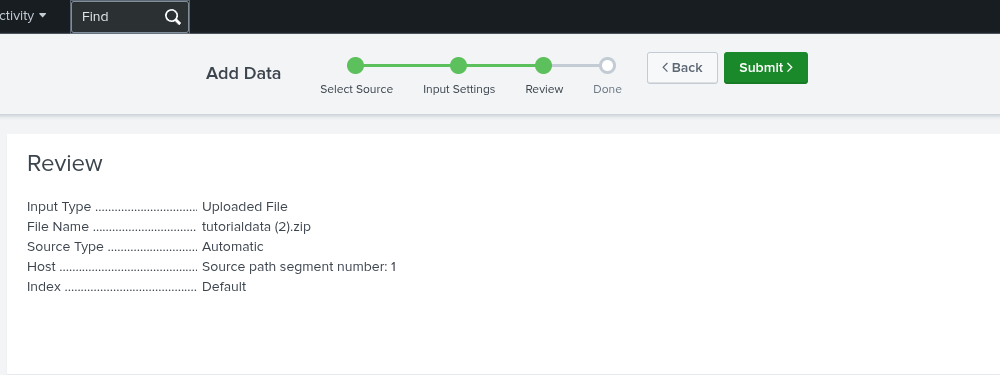

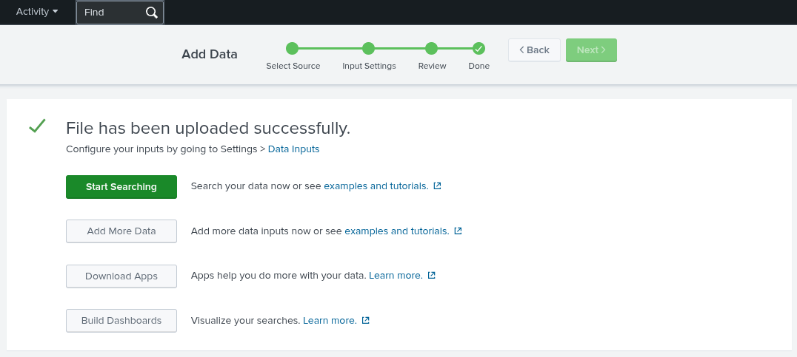

## Basic search

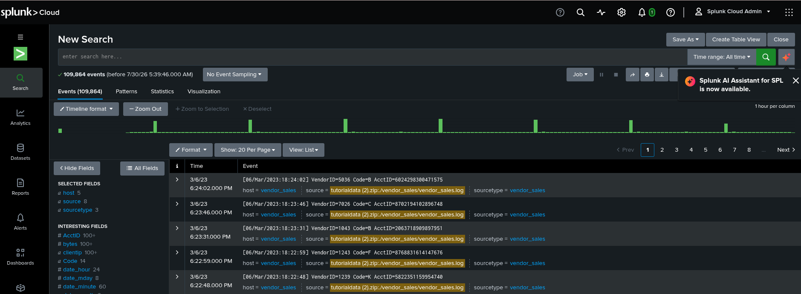

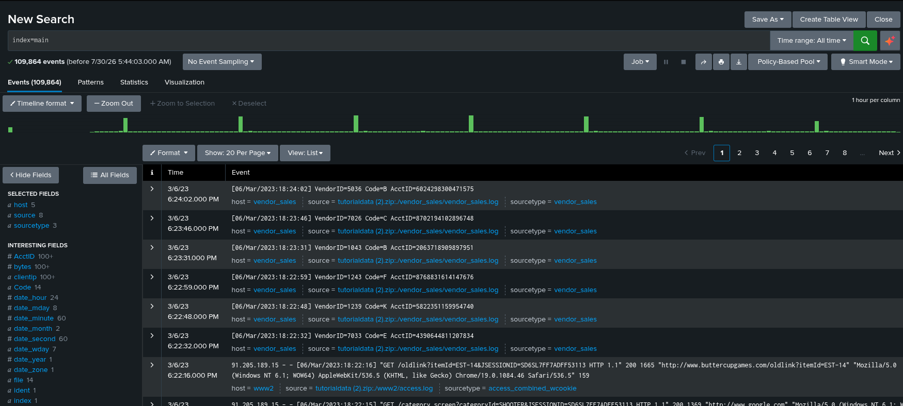

## Evaluate the fields

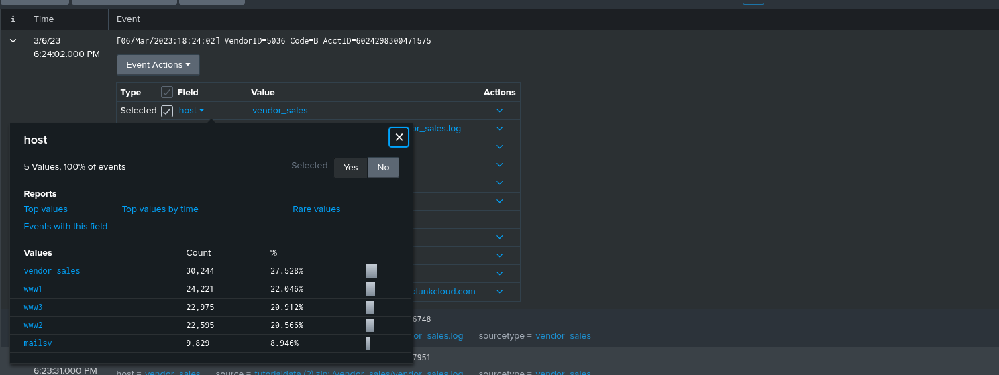

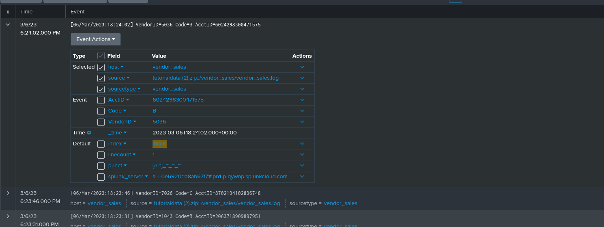

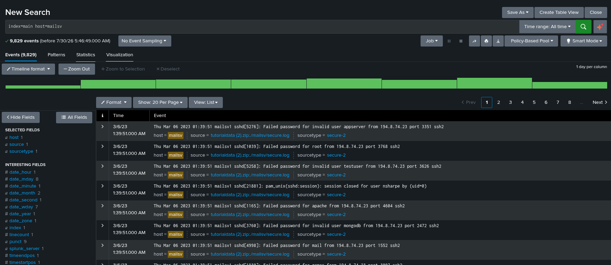

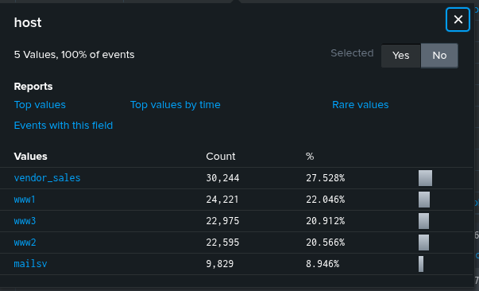

## Task

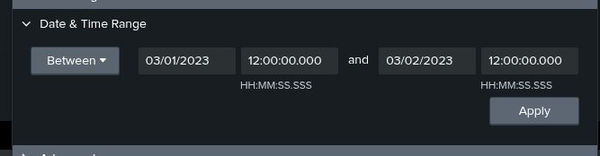

### Case1:


```
41
```

### Case2:

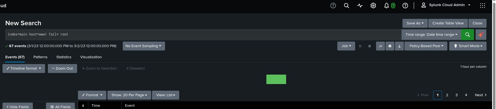

```
67
```

### Case3:


```
57
```

### Case4:

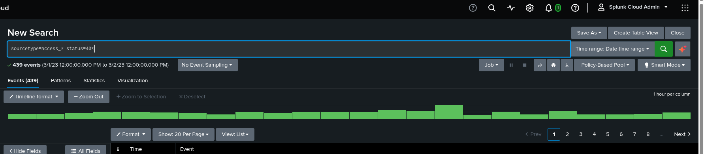

```
439
```

### Case5:

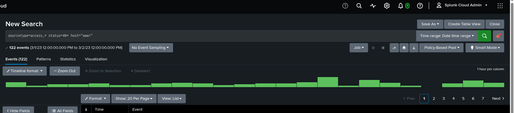

```
122
```

### Case6:

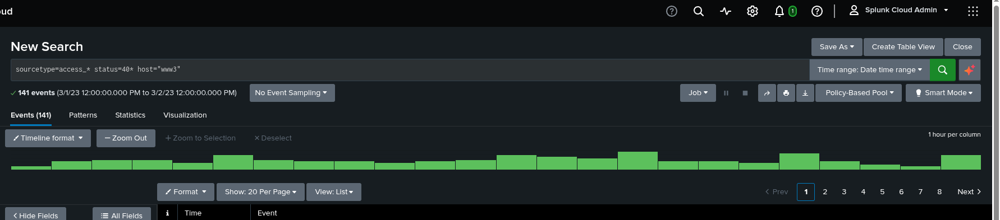

```
141
```

### Case7:

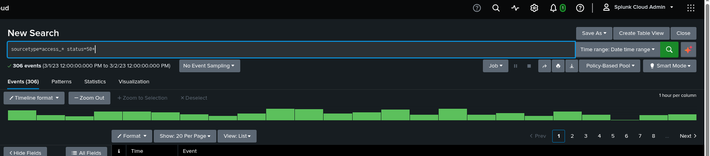

```
306
```

### Case8:

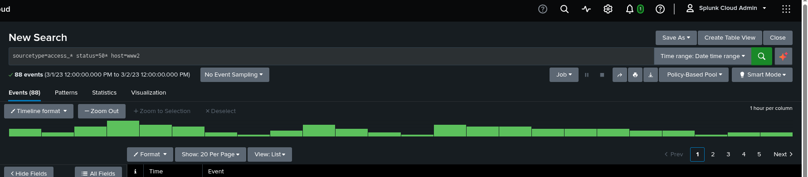

```
88
```

### Case9:

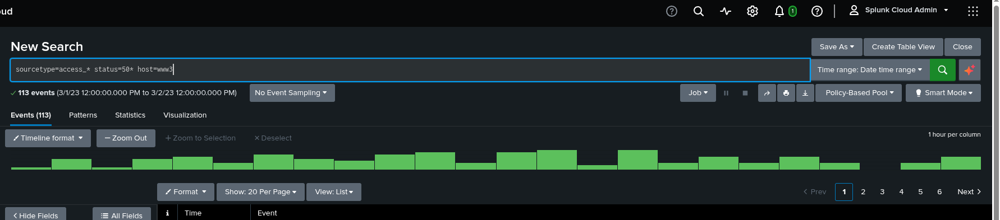

```
113
```

### Case10:

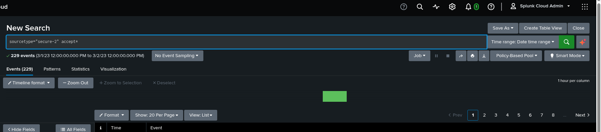

```
229
```

### Case11:

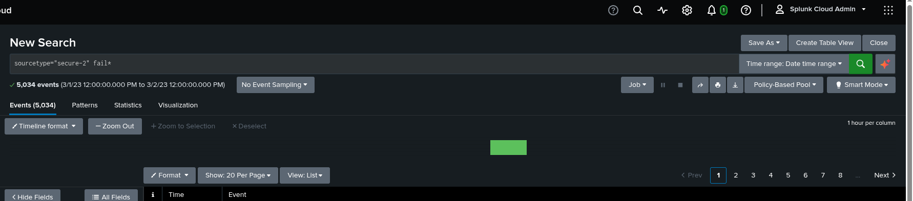

```
5034
```

### Case12:

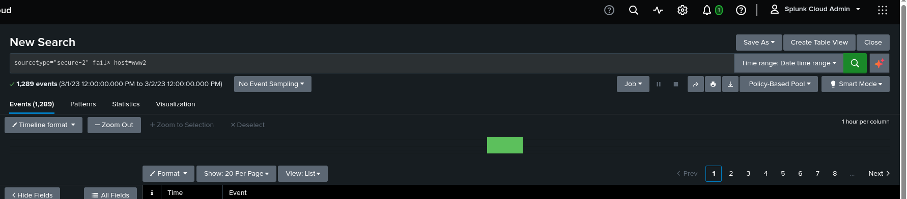

```
1289
```

### Case13:

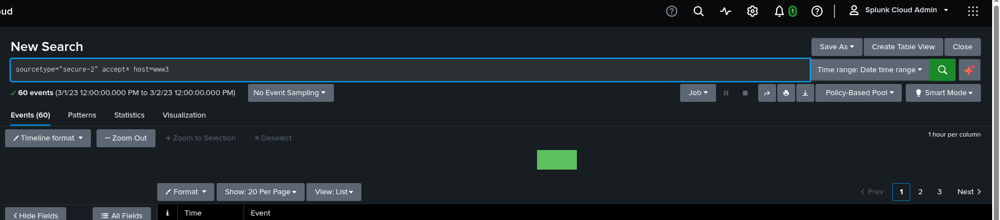

```
60
```

### Case14:


```
39
```
