# Suricata

## Step 1: VM installation, ssh connection.

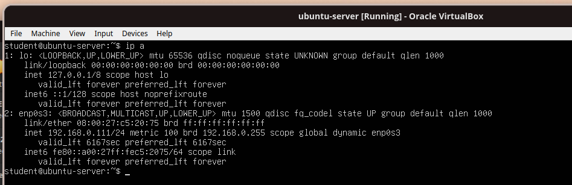

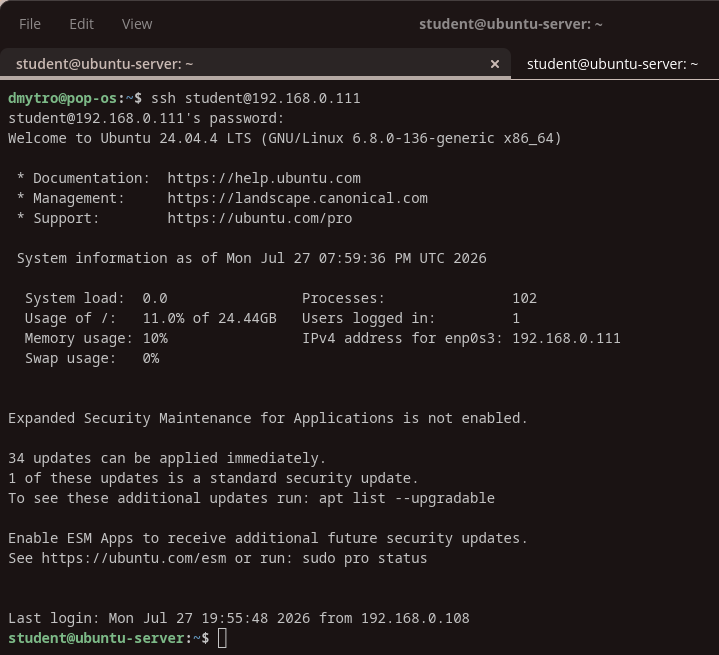

## Step 2: Installation of needed software.

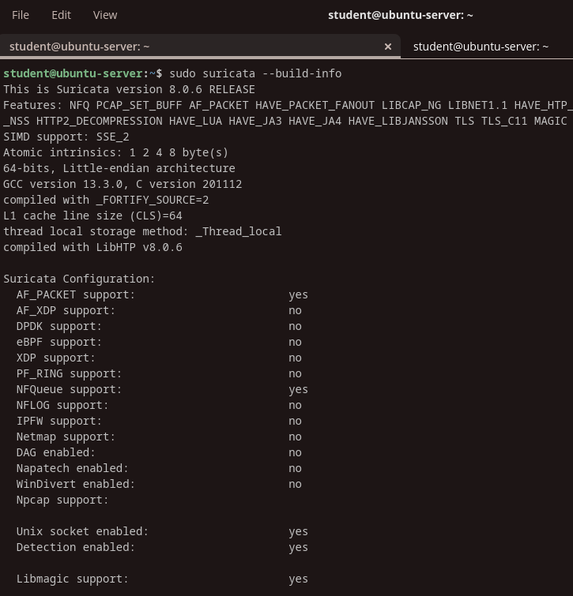

Commands:

```
sudo apt-get install software-properties-common
sudo add-apt-repository ppa:oisf/suricata-stable
sudo apt update
sudo apt install suricata jq
sudo suricata --build-info
sudo systemctl status suricata
```

# Step 3: Customize configuration.

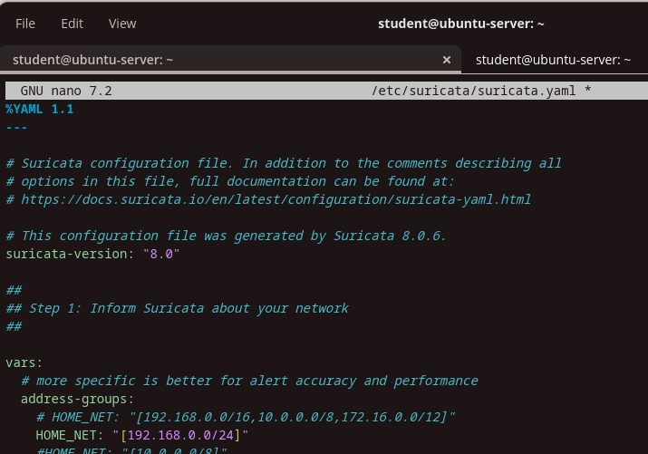

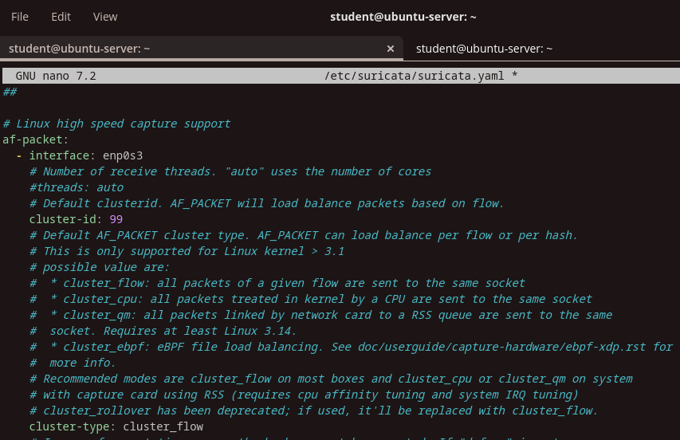

Changes:

```
	HOME_NET: "[192.168.0.0/24]"
af-packet:
	- interface: enp0s3
	  cluster-id: 99
	  cluster-type: cluster_flow
	  defrag: yes
      use-mmap: yes
	  tpacket-v3: yes
```

# Step 4: Installing Suricata signatures

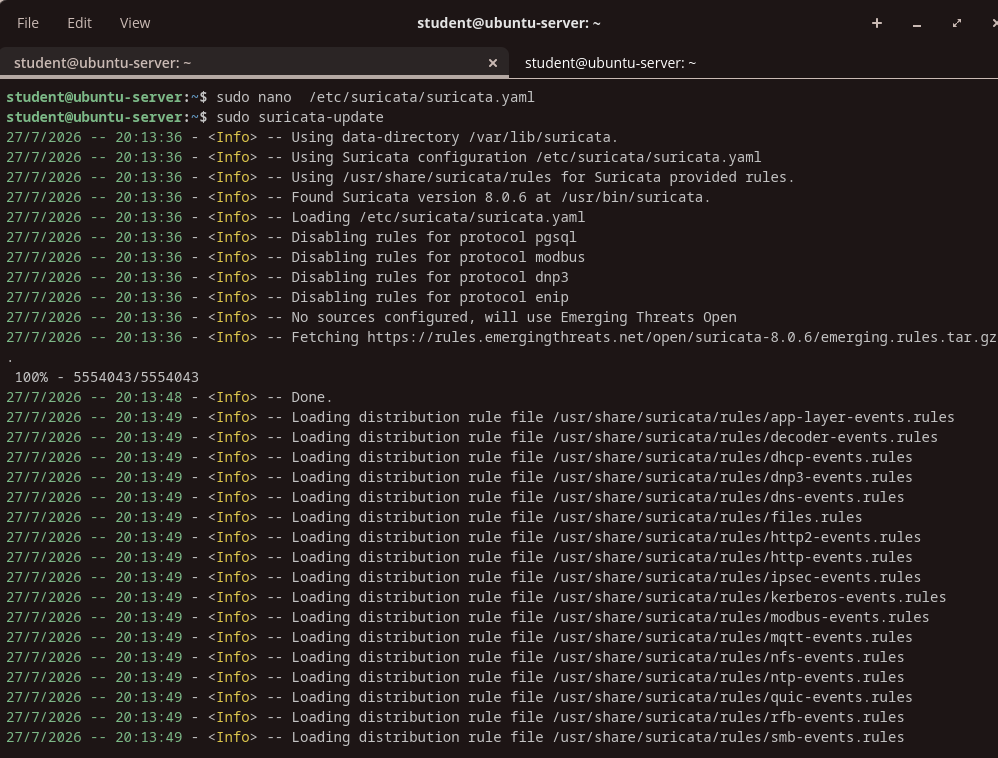

# Step 5: Running Suricata.

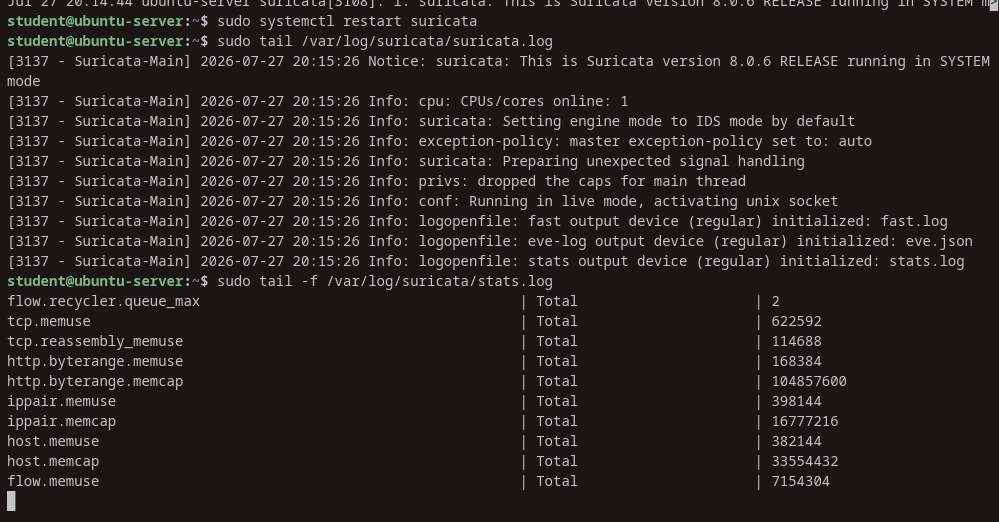

Commands:

```
sudo systemctl restart suricata
sudo tail /var/log/suricata/suricata.log
sudo tail -f /var/log/suricata/stats.log
```

# Step 6: Alerting with Suricata signature.

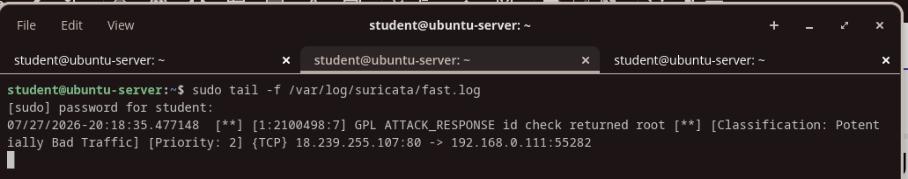

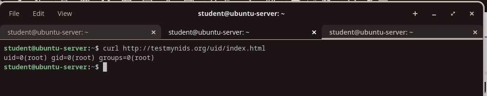

Commands:

```
sudo tail -f /var/log/suricata/fast.log
curl http://testmynids.org/uid/index.html
```

# Step 7: EVE JSON Suricata logs format.

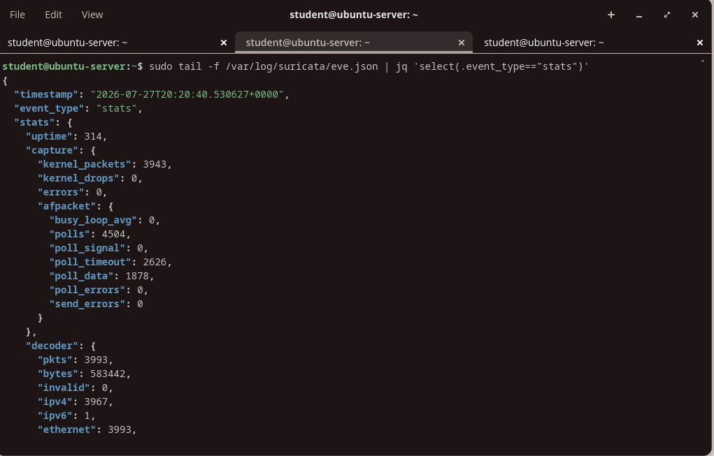

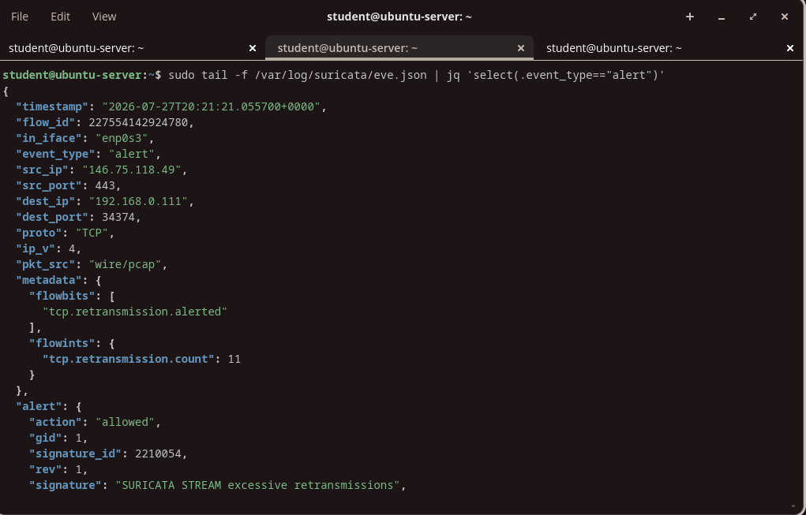

Commands:

```
sudo tail -f /var/log/suricata/eve.json | jq 'select(.event_type=="stats")'
sudo tail -f /var/log/suricata/eve.json | jq 'select(.event_type=="alert")'
```

# Step 8: Suricata rules format.

Rule:

```
alert http $HOME_NET any -> $EXTERNAL_NET any (msg:"HTTP GET Request Containing Rule in URI"; flow:established,to_server; http.method; content:"GET"; http.uri; content:"rule"; fast_pattern; classtype:bad-unknown; sid:123; rev:1;)
```

# Step 9:Suricata local rules creation and configuring suricata.yaml.

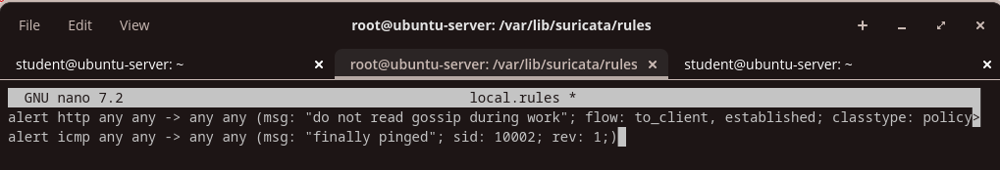

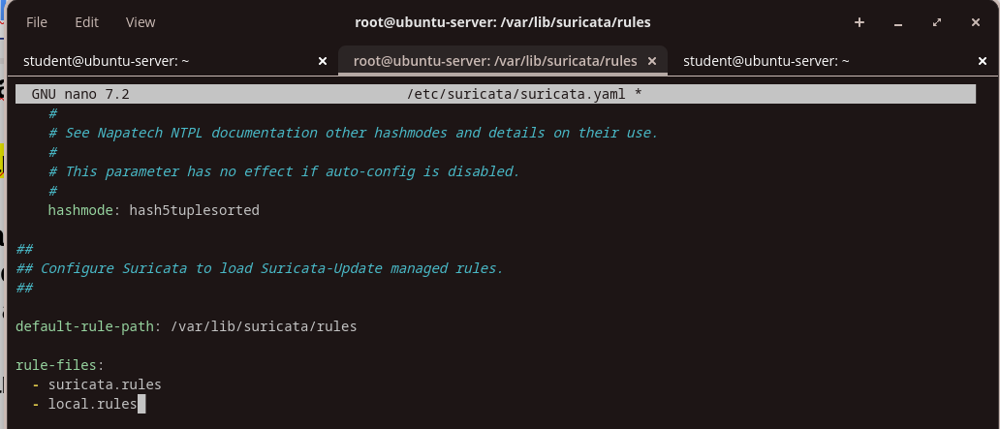

Commands:

```
nano local.rules
nano /etc/suricata/suricata.yaml
```

Changes:

```
 - local.rules
```

Rules:

```
alert http any any -> any any (msg: "do not read gossip during work"; flow: to_client, established; classtype: policy-violation; sid: 10001; rev: 1;)
alert icmp any any -> any any (msg: "finally pinged"; sid: 10002; rev: 1;)
```

# Step 10: Suricata local rules management.

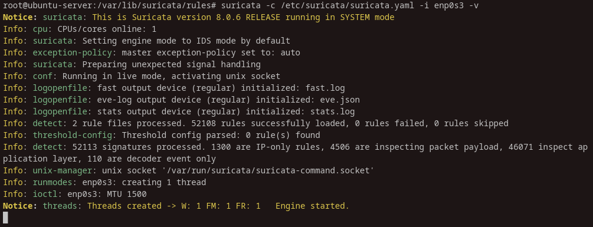

Command:

```
suricata -c /etc/suricata/suricata.yaml -i enp0s3 -v
```

# Step 11: Suricata local rules in action.

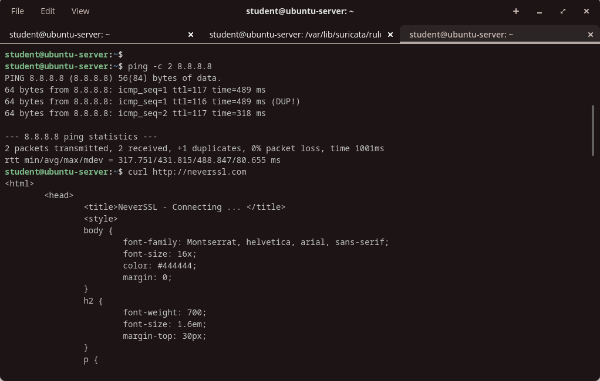
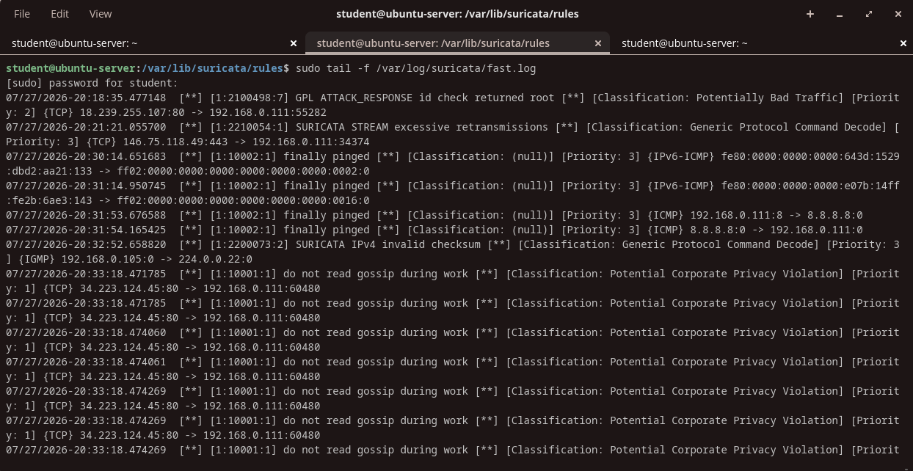

Commands:

```
sudo tail -f /var/log/suricata/fast.log
ping -c 2 8.8.8.8
curl http://neverssl.com
```

## Custom rules(TaskIDS)

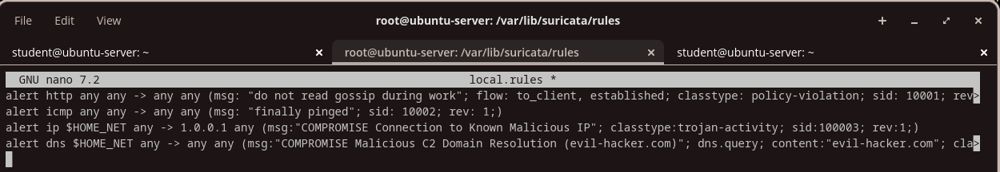

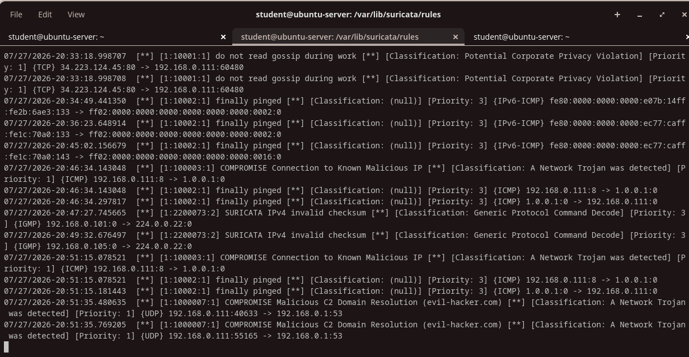

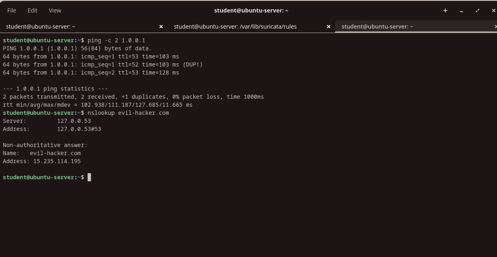

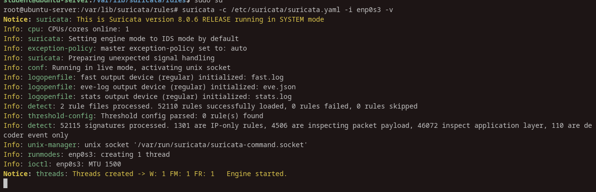

Rules:

```
alert ip $HOME_NET any -> 1.0.0.1 any (msg:"COMPROMISE Connection to Known Malicious IP"; classtype:trojan-activity; sid:100003; rev:1;)

alert dns $HOME_NET any -> any any (msg:"COMPROMISE Malicious C2 Domain Resolution (evil-hacker.com)"; dns.query; content:"evil-hacker.com"; classtype:trojan-activity; sid:1000007; rev:1;)
```

Rule 1: monitors all outbound network traffic (IP) originating from the local network ($HOME_NET) and targeting a specific, simulated malicious IP(1.0.0.1) on any port.

Rule 2: inspects outbound DNS traffic to detect attempts to resolve a specific Command and Control (C2) domain (evil-hacker.com). By analyzing the dns.query buffer, it identifies compromised hosts attempting to contact the attacker's infrastructure, regardless of the underlying IP address the domain resolves to.

Alerts:

```
07/27/2026-20:51:15.078521  [**] [1:100003:1] COMPROMISE Connection to Known Malicious IP [**] [Classification: A Network Trojan was detected] [Priority: 1] {ICMP} 192.168.0.111:8 -> 1.0.0.1:0
07/27/2026-20:51:35.480635  [**] [1:1000007:1] COMPROMISE Malicious C2 Domain Resolution (evil-hacker.com) [**] [Classification: A Network Trojan was detected] [Priority: 1] {UDP} 192.168.0.111:40633 -> 192.168.0.1:53
```
