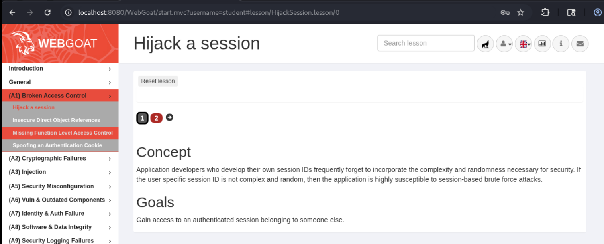
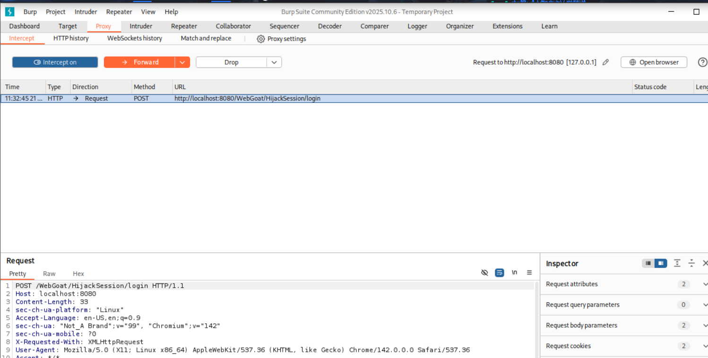
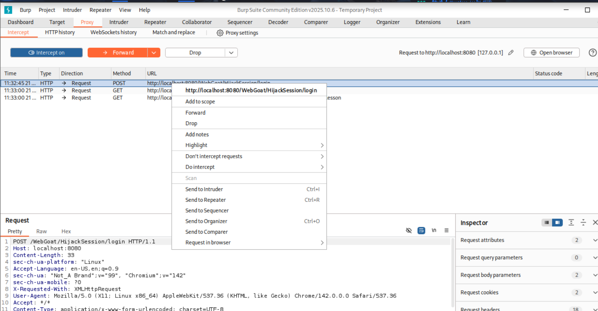
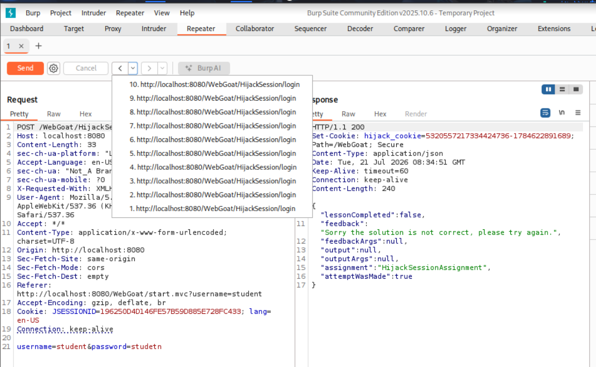
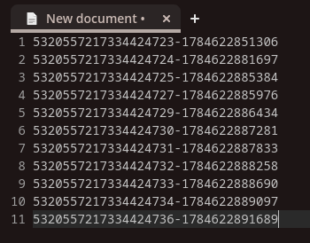
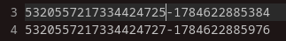
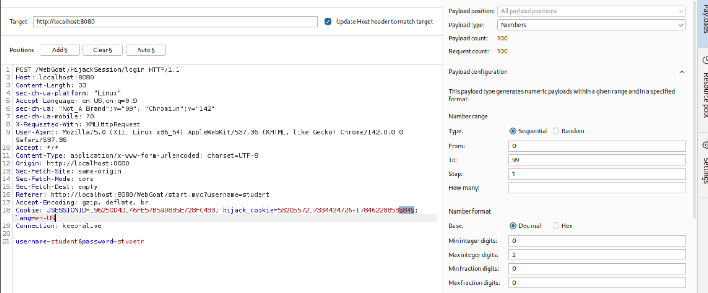

# Hijack a session

Обираємо відповідне завдання з меню WebGoat.



## Проходження завдання

Запускаємо Burp Suite, переходимо до вкладки Proxy та вмикаємо режим Intercept для перехоплення мережевого трафіку.


Здійснюємо спробу авторизації у формі, щоб згенерувати HTTP запит.


Перехоплений POST запит:


Передаємо цей запит до інструменту Repeater для зручної маніпуляції та багаторазового відправлення без повторного використання браузера.


Виконуємо серію запитів для збору масиву значень `hijack_cookie` з відповідей сервера для їх подальшого аналізу.






Аналіз зібраних cookie виявляє їхню структуру: перша частина — це послідовний ідентифікатор сесії, а друга є часовою міткою (Timestamp).

```text
5320557217334424723-1784622851306
5320557217334424724-1784622881697
5320557217334424725-1784622885384
5320557217334424727-1784622885976
5320557217334424729-1784622886434
5320557217334424730-1784622887281
5320557217334424731-1784622887833
5320557217334424732-1784622888258
5320557217334424733-1784622888690
5320557217334424734-1784622889097
5320557217334424736-1784622891689
```

У послідовності виявлено прогалину: між ідентифікаторами `...4725` та `...4727` відсутній запис. Це вказує на те, що сесію, яка закінчується на `26`, було згенеровано для іншого користувача в цей проміжок часу.



Передаємо запит до інструменту Intruder. Налаштовуємо брутфорс атаку на останні дві цифри часової мітки пропущеної сесії, перебираючи значення від `00` до `99`.


Запускаємо атаку та очікуємо на зміну розміру відповіді або статусу.


Атака пройшла успішно: знайдено правильний payload, в результаті чого підібрано валідний cookie та отримано доступ до чужої сесії. Завдання виконано.

