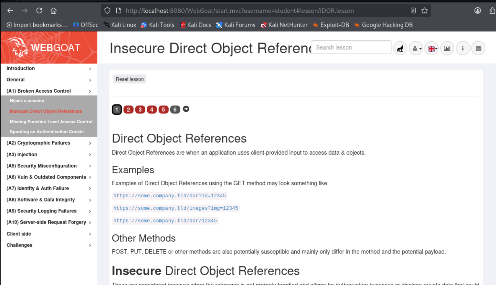
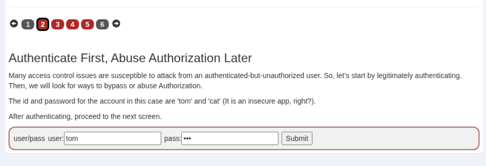
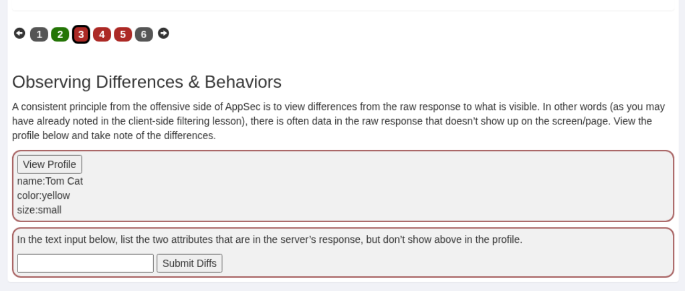
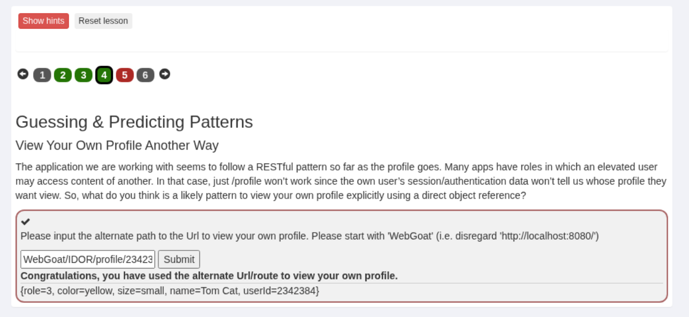
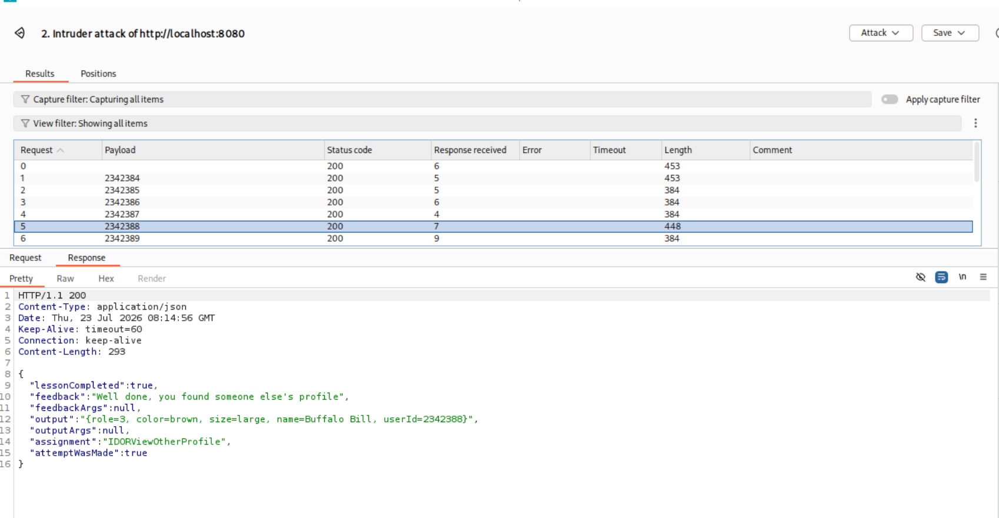

# IDOR

Обираємо відповідне завдання з меню WebGoat.

## Проходження завдання

### Спочатку автентифікація, потім — зловживання авторизацією

### Спостереження відмінностей і поведінки

Перехоплений запит, для дослідження відмінностей і поведінки.

Відмінності: role, UserId.

### Вгадування та передбачення шаблонів

Url для перегляду свого профілю - `WebGoat/IDOR/profile/2342384`.

### Гра з шаблонами

Передаємо запит до інструменту Intruder. Налаштовуємо брутфорс атаку, перебираючи значення від `2342384` до `2342399`.

Запускаємо атаку та очікуємо на зміну розміру відповіді або статусу.

Атака пройшла успішно: знайдено правильний payload, в результаті чого підібрано ID іншого профілю.

### Редагування іншого профілю

Створення нового запиту для редагування іншого профілю.

Завдання виконано успішно.

